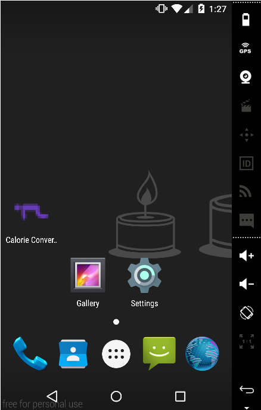
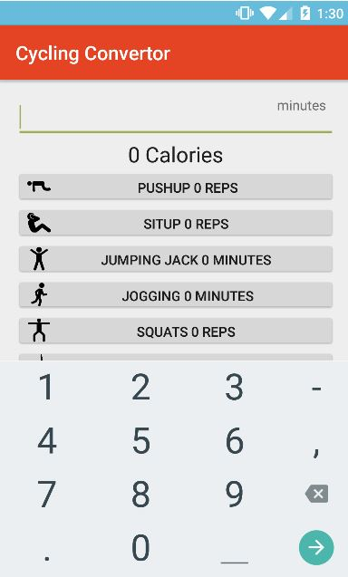

# PROG 01: Crunch Time

This app converts the amount of exercise someone does, to the amount of calories it burned by exercising (rounded). It also 
finds out what are the caloric equivalents in terms of other types of exercise (also rounded, because it doesn't make sense to 
do half a pushup, and half a minute doesn't really make a difference). It includes all 12 exercises. 

## Authors

Jenny Lu ([j.lu@berkeley.edu](mailto:j.lu@berkeley.edu))

## Demo Video

https://youtu.be/rHVOYA9EaLM

## Screenshots

## Acknowledgments

* All my icons used in this app came from one website full of vector images. I do not know how to credit in
the app, but I would like to credit them here. 

Icon made by <a href="http://www.freepik.com" title="Freepik">Freepik</a> from 
<a href="http://www.flaticon.com" title="Flaticon">www.flaticon.com</a> is licensed under 
<a href="http://creativecommons.org/licenses/by/3.0/" title="Creative Commons BY 3.0">CC BY 3.0</a>

☺

